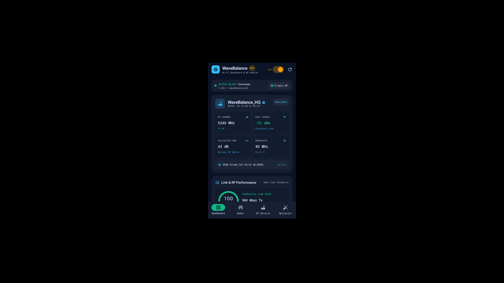
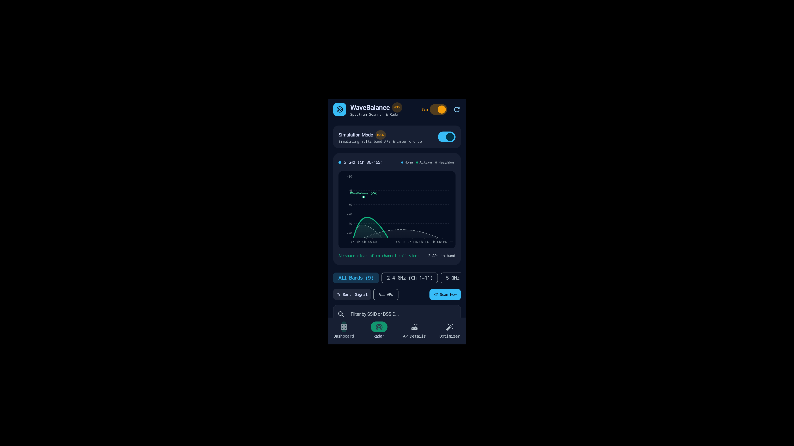
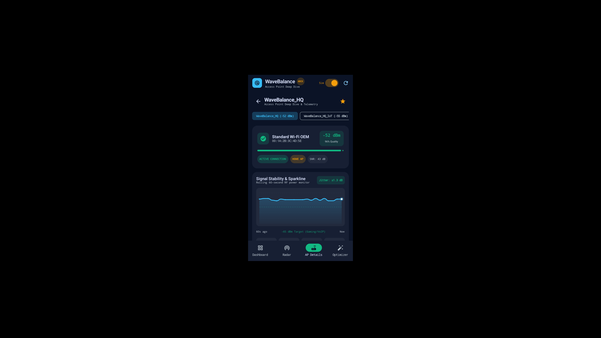
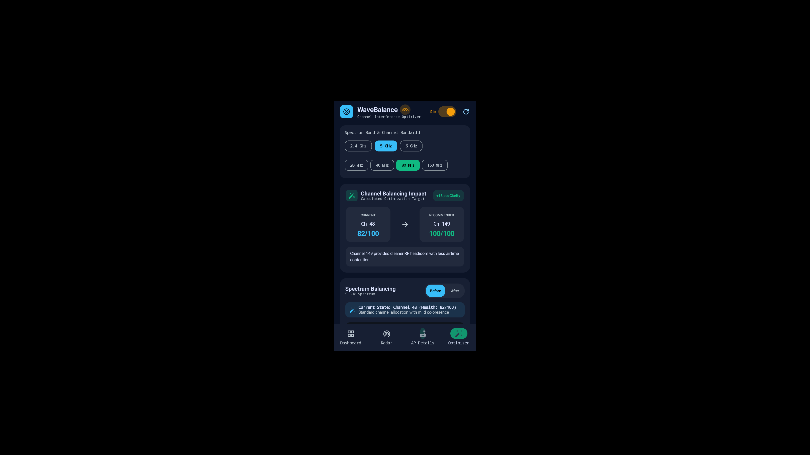

# WaveBalance 📡

[](https://developer.android.com/about/dashboards)
[](https://kotlinlang.org)
[](https://developer.android.com/jetpack/compose)
[](https://m3.material.io)
[](https://stitch.withgoogle.com)
[]()
[]()

> **WaveBalance** is an adaptive, high-precision Wi-Fi spectrum analyzer and channel balancing engine for Android. Built with Jetpack Compose, Material Design 3, and Google Stitch design tokens, WaveBalance quantifies wireless airspace congestion, detects co-channel and adjacent-channel collisions, models parabolic RF envelopes, and calculates mathematically optimal router reconfiguration directives.

---

## 📸 Visual Walkthrough

| 1. Adaptive Dashboard | 2. Spectrum Radar |
|:---:|:---:|
|  |  |
| *Active network telemetry, circular RF health gauge, quick spectrum waterfall, and nearby AP scan feed.* | *Parabolic RF power envelopes across 2.4 GHz, 5 GHz, and 6 GHz spectrum blocks with channel markers.* |

| 3. AP Details & Collision Alerts | 4. Channel Optimizer & Directives |
|:---:|:---:|
|  |  |
| *60-second cubic Bezier RSSI sparkline, jitter ($\sigma$) calculation, hardware OUI vendor decoding, and collision alerts.* | *Before/After spectrum balancing comparison, step-by-step router reconfiguration directives, and congestion matrix.* |

---

## ✨ Features & Architecture

### 1. Adaptive Wi-Fi Dashboard (`DashboardScreen.kt`)
- **Active Network Hero Card**: Real-time telemetry for the currently connected BSSID/SSID, link speed (Mbps), signal strength (dBm), SNR, and network generation (Wi-Fi 4 through Wi-Fi 7).
- **Circular RF Health Gauge**: Vector-drawn dual-arc sweep gauge computing a normalized 0–100% health score derived from signal-to-noise ratio, link stability, and channel contention.
- **Spectrum Mini-Waterfall**: Real-time density breakdown across **2.4 GHz**, **5 GHz**, and **6 GHz** bands.
- **Nearby AP Telemetry Feed**: Searchable and filterable access point cards with live signal meters, frequency badges, and vendor OUI recognition.

### 2. Multi-Band Spectrum Radar (`ParabolicRadarGraph.kt`)
- **Parabolic RF Curves**: Custom Jetpack Compose Canvas mathematical renderer calculating continuous transmission parabolas:
  $$y(x) = y_{\text{peak}} - \alpha (x - x_c)^2$$
- **Band Switching**: Seamless navigation across:
  - **2.4 GHz**: Channels 1 through 14 (showing classic 20/40 MHz channel bleed).
  - **5 GHz**: UNII-1, UNII-2 (DFS), UNII-2e (DFS), and UNII-3 channels (20, 40, 80, 160 MHz envelopes).
  - **6 GHz**: Preferred Scanning Channels (PSC) for Wi-Fi 6E and Wi-Fi 7 (up to 320 MHz bandwidth).
- **Interactive Highlighting**: Tap any channel marker or AP curve to inspect frequency boundaries and conflicting signals.

### 3. Access Point Telemetry & Collision Engine (`ApDetailScreen.kt`)
- **60-Second Rolling RSSI Sparkline**: High-frequency continuous time-series canvas using cubic Bezier curves (`cubicTo`) with an illuminated beacon at the latest telemetry coordinate.
- **Mathematical Jitter Analysis**: Real-time standard deviation calculation ($\sigma = \sqrt{\frac{1}{N}\sum(x_i - \mu)^2}$) displayed with peak, dip, and average RSSI metrics.
- **-65 dBm Target Threshold**: Calibrated dashed benchmark line indicating the golden standard for low-latency VoIP and competitive online gaming.
- **Hardware OUI Vendor Decoder**: Resolves hardware manufacturers (Google, Apple, Netgear, Ubiquiti, Cisco, TP-Link, Samsung, etc.) with automatic identification of locally-administered **Private / Randomized MAC** addresses.
- **PHY Theoretical Speed Calculator**: Computes theoretical physical layer ceilings based on channel width, modulation schemes, and MIMO spatial stream capabilities (e.g. 5764 Mbps on Wi-Fi 7 320 MHz 2x2).
- **Collision & Interference Alerts**: Differentiates between **Co-Channel Interference (CCI)** and **Adjacent-Channel Interference (ACI)** with contextual remediation guidance.

### 4. Mathematical Optimizer Engine & Balancing (`OptimizerScreen.kt`)
- **Interference Penalty Algorithm**: Evaluates candidate channels using weighted co-channel collisions ($W_{\text{cci}} = 1.0$), adjacent channel bleed ($W_{\text{aci}} = 0.5$), and DFS penalties to generate a 0–100 score.
- **Interactive Before vs. After View**:
  - *Before Mode*: Renders the current congested spectrum.
  - *After Mode*: Animates the network shifted to the calculated optimal channel in vibrant emerald (`✓ [SSID] (Ch X OPTIMAL)`), subduing conflicting background signals.
- **Router Configuration Directives**: Synthesizes 5 tailored router admin actions with a one-tap **Copy Setup** button formatted for the Android system clipboard.
- **In-App Channel Migration Simulator**: Test-drive optimized network placements without touching router settings.
- **Ranked Channel Congestion Matrix**: Color-coded candidate matrix ranking every available frequency channel with collision counts and health ratings (`Optimal`, `Good`, `Fair`, `Congested`).

---

## 🎨 Design System & Stitch Tokens

WaveBalance is styled using tokens from **Google Stitch** (Project ID: `5449578052354054440`), optimized for dark-mode RF telemetry:

| Token Name | Hex Code | Visual Role |
|:---|:---:|:---|
| `PrimaryObsidian` | `#0A0F1D` | Global app scaffold background |
| `SurfaceNavyDark` | `#111827` | Top app bars, bottom navigation bar, card headers |
| `CardSurfaceSlate` | `#1E293B` | Telemetry cards, canvas backgrounds, dialogs |
| `NeonCyan` | `#00F5FF` | Active network highlights, RF radar parabolas, primary actions |
| `SecondaryContainerEmerald` | `#10B981` | Optimal channel badges, balanced states, pristine spectrum indicators |
| `WarningAmber` | `#F59E0B` | Moderate contention warnings, DFS radar alerts |
| `ErrorRed` | `#EF4444` | Severe collision alerts, congested channel penalties |

---

## 📱 Hardware & Compatibility

- **Primary Target Device**: Tested on **Google Pixel 10 Pro XL** over wireless ADB TLS.
- **Emulator Support**: Companion testing on Android 16 / ARCVM emulator (`emulator-5554`).
- **Android Versions**: API Level 26 (Android 8.0 Oreo) up to API Level 35+ (Android 15 / 16).
- **Wi-Fi Standards Supported**: 802.11b/g/n (Wi-Fi 4), 802.11ac (Wi-Fi 5), 802.11ax (Wi-Fi 6 / 6E), and 802.11be (Wi-Fi 7).
- **Simulation Mode**: Built-in mock telemetry engine accessible directly from the top bar for testing complex multi-AP collision environments on emulators or offline environments.

---

## 🛠️ Build & Installation

### Prerequisites
- **JDK 17** (or higher)
- **Android SDK Platform 35**
- **Gradle 8.7+** (Gradle Wrapper included)
- **ADB** (Android Debug Bridge)

### Build from Source
```bash
# Clone the repository
git clone https://github.com/yogeshware/wavebalance.git
cd wavebalance

# Run the unit test suite
./gradlew test

# Compile the debug APK
./gradlew assembleDebug
```

### Deploy to Connected Device
```bash
# Install on Google Pixel 10 Pro XL or connected emulator
adb install -r app/build/outputs/apk/debug/app-debug.apk

# Launch WaveBalance
adb shell am start -n com.wavebalance.app/.MainActivity
```

---

## 🧪 Unit Test Suite

The project includes unit tests covering RF calculations and optimization logic:
- [`ChannelOptimizerEngineTest.kt`](app/src/test/java/com/wavebalance/app/ChannelOptimizerEngineTest.kt): Validates co-channel scoring penalties, alternative channel selection, router directives generation, and 2.4 GHz non-overlapping evaluations.
- [`ApMetricsCalculatorTest.kt`](app/src/test/java/com/wavebalance/app/ApMetricsCalculatorTest.kt): Tests frequency envelope boundaries, PHY throughput calculation across Wi-Fi 6/7, and interference severity classification.
- [`WifiVendorLookupTest.kt`](app/src/test/java/com/wavebalance/app/WifiVendorLookupTest.kt): Verifies known IEEE OUI prefix matching and locally-administered randomized MAC address detection.

Run tests with:
```bash
./gradlew testDebugUnitTest
```

---

## 📄 License

```text
MIT License

Copyright (c) 2026 Yogeshwar Kaushal

Permission is hereby granted, free of charge, to any person obtaining a copy
of this software and associated documentation files (the "Software"), to deal
in the Software without restriction, including without limitation the rights
to use, copy, modify, merge, publish, distribute, sublicense, and/or sell
copies of the Software, and to permit persons to whom the Software is
furnished to do so, subject to the following conditions:

The above copyright notice and this permission notice shall be included in all
copies or substantial portions of the Software.

THE SOFTWARE IS PROVIDED "AS IS", WITHOUT WARRANTY OF ANY KIND, EXPRESS OR
IMPLIED, INCLUDING BUT NOT LIMITED TO THE WARRANTIES OF MERCHANTABILITY,
FITNESS FOR A PARTICULAR PURPOSE AND NONINFRINGEMENT. IN NO EVENT SHALL THE
AUTHORS OR COPYRIGHT HOLDERS BE LIABLE FOR ANY CLAIM, DAMAGES OR OTHER
LIABILITY, WHETHER IN AN ACTION OF CONTRACT, TORT OR OTHERWISE, ARISING FROM,
OUT OF OR IN CONNECTION WITH THE SOFTWARE OR THE USE OR OTHER DEALINGS IN THE
SOFTWARE.
```
