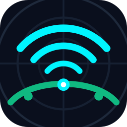
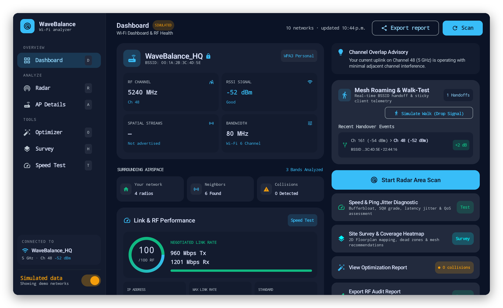
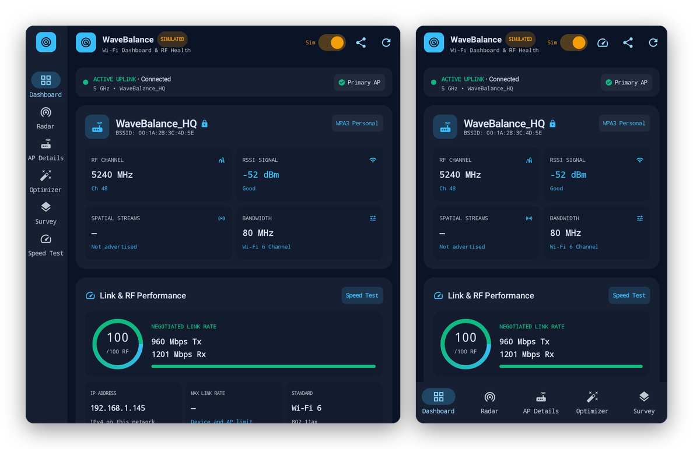
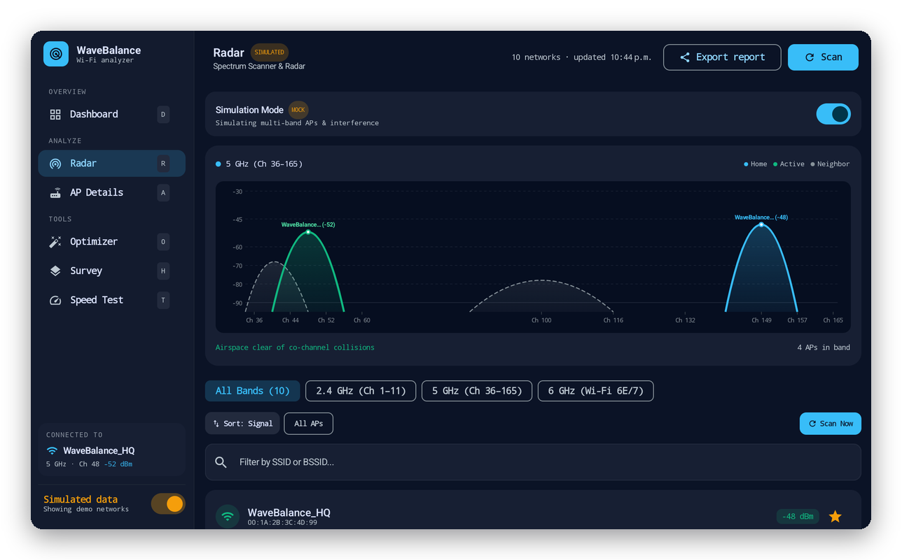
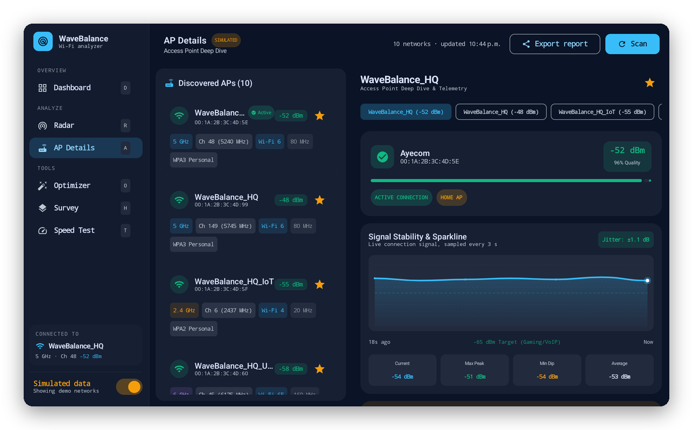
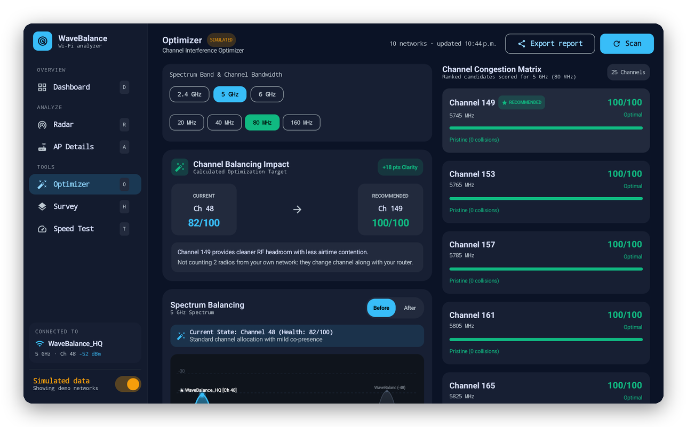
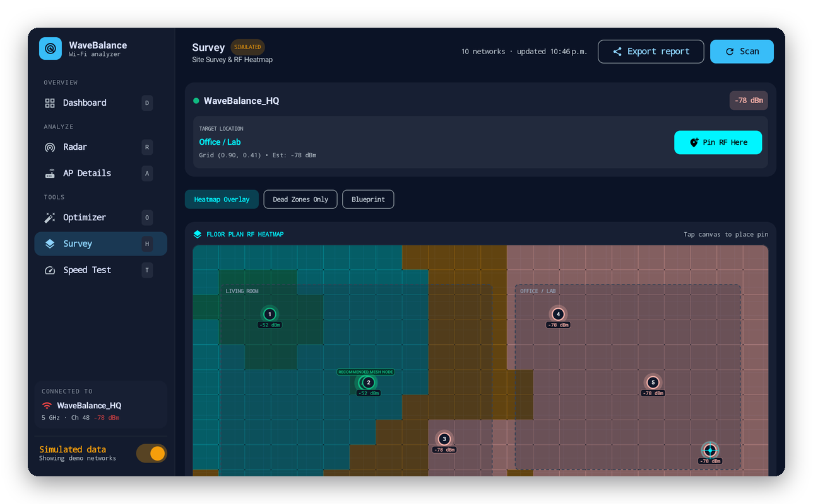

<p align="center">
  
</p>

<h1 align="center">WaveBalance</h1>

<p align="center">
  <b>A Wi-Fi analyzer for Googlebooks, built for a desktop window.</b><br>
  See every network around you, find the clearest channel for your router, map your coverage
  room by room and measure your real speed, with a layout that uses the whole screen.
</p>

<p align="center">
  <a href="../../releases/latest/download/WaveBalance.apk"><b>⬇ Download WaveBalance.apk</b></a>
  &nbsp;·&nbsp; <a href="#install">Install</a>
  &nbsp;·&nbsp; <a href="#privacy">Privacy</a>
  &nbsp;·&nbsp; <a href="CHANGELOG.md">What's new</a>
  &nbsp;·&nbsp; <a href="#licenses">Licenses</a>
</p>

<p align="center">
  
  
  
  
  
</p>

<p align="center"><sub>Created by <a href="https://github.com/yogeshware">yogeshware</a>; this Googlebook edition is published by <a href="https://github.com/sanjaynathwani-blip">sanjaynathwani-blip</a>.
Not affiliated with or endorsed by any employer, or by Google or M-Lab (<a href="#about-this-project">more</a>).</sub></p>

<p align="center">
  
</p>

<p align="center"><sub>All screenshots show WaveBalance's built-in simulated data, not a real network.</sub></p>

## What it is

WaveBalance is a free, open-source Wi-Fi analyzer. It scans the networks around you and shows
what's on each channel, which access point you're connected to and how well, which channel your
router should move to, and how fast your connection really is. Everything it shows is either
read from Android and the access points, or measured; when something isn't known, it says so.

- **Dashboard:** your connection at a glance: channel, signal, security, spatial streams,
  bandwidth, link rate, and how crowded the airspace is.
- **Radar:** every network drawn on its channels, band by band, so overlaps are obvious.
- **AP Details:** each access point's vendor, security, Wi-Fi generation, roaming support
  (802.11k/v/r) and a live signal graph for the one you're on.
- **Optimizer:** scores every channel and recommends the clearest one for your router.
- **Survey:** pin signal readings on a floor plan, room by room, and see the coverage as a
  heatmap with dead zones.
- **Speed Test:** real download, upload, ping, jitter and bufferbloat against the nearest
  [M-Lab](https://www.measurementlab.net/) server.
- **Export report:** the whole picture as a Markdown summary, through Android's share sheet.

## Made for the Googlebook

WaveBalance is designed for a laptop: a resizable window, a keyboard and a mouse.

- **A desktop layout.** A navigation panel down the left shows every screen with its shortcut
  key, and the Dashboard, the Optimizer and the Speed Test use two columns, so far more fits on
  screen at once.
- **Any window size.** Resize the window and the layout follows: a side rail when it's medium,
  a bottom bar at phone width, and the full panel when there's room.
- **Keyboard first:**

| Keys | Action |
| --- | --- |
| D or 1 | Dashboard |
| R or 2 | Radar |
| H or 3 | Survey |
| A or 4 | AP Details |
| O or 5 | Optimizer |
| T | Speed Test |
| Space | Scan now |
| E | Export report |
| P | Pin the current signal on the survey |
| S | Switch between live scans and simulated data |
| W / M | Simulate walking away / roaming to another access point (simulated data only) |

<p align="center">
  
  <br><sub>The same app in a medium window and at phone width.</sub>
</p>

## The screens

<table>
  <tr>
    <td width="50%"><br><b>Radar.</b> Each network as a curve over the channels it uses, so you can see who overlaps whom. Filter by band, sort by signal, search by name.</td>
    <td width="50%"><br><b>AP Details.</b> Every access point with its channel, width, Wi-Fi generation and security; the vendor from the IEEE registry; and a live signal graph for your connection.</td>
  </tr>
  <tr>
    <td width="50%"><br><b>Optimizer.</b> Scores each channel for the band and width you pick and recommends the clearest. Your own network's other radios aren't counted as interference.</td>
    <td width="50%"><br><b>Survey.</b> Walk around, pin the signal where you stand, and see your coverage as a heatmap, with dead zones and a suggested spot for a mesh node.</td>
  </tr>
</table>

## Real readings, no guesswork

WaveBalance only shows what it can know:

- **From the access points:** security (WPA2, WPA3, open), protected management frames, spatial
  streams, Wi-Fi generation and 802.11k/v/r support, read from each network's beacon.
- **Wide channels** are drawn on their real centre frequency, not on the primary channel.
- **Your own network** is recognised by its addresses, across bands, guest networks and mesh
  nodes, and kept out of the interference counts.
- **Not shown:** noise floor and SNR, which Android doesn't report. Signal graphs only draw real
  samples: every 3 seconds for your connection, once per scan for the others.

**The speed test** measures over one connection each way, as M-Lab's
[ndt7](https://github.com/m-lab/ndt-server/blob/main/spec/ndt7-protocol.md) test does. Tests that
open several connections at once (Speedtest.net, for example) usually show a higher download. A
full test transfers several hundred megabytes on a fast connection, and M-Lab allows 40 tests per
device a day; **Ping Only** measures latency and jitter without running a test.

## Install

WaveBalance isn't in a store; you install the APK from this page. It takes a minute:

1. On your Googlebook (or any Android 8.0+ device), download
   **[WaveBalance.apk](../../releases/latest/download/WaveBalance.apk)**.
2. Open it: click the download in Chrome, or find **WaveBalance.apk** in the **Files** app under
   Downloads.
3. The first time, Android asks whether Chrome (or Files) may install apps: choose **Settings**,
   turn on **Allow from this source**, go back and click **Install**.
4. **Google Play Protect** may say it doesn't recognise the developer, because WaveBalance isn't
   on the Play Store: choose **More details → Install anyway**, or let it scan the app first.
5. Open **WaveBalance** and allow **location** and **nearby devices** when asked, and make sure
   **Location** is on in quick settings. Android only shows Wi-Fi networks to apps with these.

**Updating:** download the new WaveBalance.apk and install it over the old one. Every release is
signed with the same key, and Android refuses an update signed with another, so only install
WaveBalance from this page.

**Checking the download** (optional): each release lists SHA-256 checksums in `SHA256SUMS`; in the
Googlebook's Linux Terminal, `sha256sum WaveBalance.apk` prints the one to compare.

**Good to know:** Android lets an app scan for Wi-Fi four times every two minutes, so scans
right after each other may show the same results.

## Privacy

- **No accounts, analytics or ads.**
- **Location stays on your device.** Android requires the location permission to see Wi-Fi
  networks, because they can reveal where you are. WaveBalance uses it only to scan, and doesn't
  read your location.
- **The internet is used only for the speed test.** It contacts M-Lab to find a nearby server and
  run the test. **M-Lab publishes every full test's results, including your IP address, as open
  data**, so WaveBalance asks before your first test and links to
  [M-Lab's privacy policy](https://www.measurementlab.net/privacy/). **Ping Only** only asks M-Lab
  for a nearby server and times connections to it; it doesn't run a test, so nothing is published.
- **Nothing is kept** except that you agreed to M-Lab's terms. Scans, survey pins and starred
  networks are cleared when the app closes, and uninstalling removes everything.
- **Export report** only shares what you choose to send, through Android's share sheet.

| Permission | Why |
| --- | --- |
| Location (precise) and nearby Wi-Fi devices | Android's requirement for seeing Wi-Fi scan results |
| Wi-Fi and network state | Reading your connection and starting scans |
| Internet | The M-Lab speed test only |

## To do

- [ ] **Networks:** combine Radar and AP Details into one list with a detail pane, and a table
  view with sortable columns.
- [ ] **More desktop:** right-click menus, tooltips and an in-app list of shortcuts.
- [ ] **Survey:** keep pins between sessions, and a wider layout for the floor plan.
- [ ] **Narrow windows:** the SIMULATED label gets squeezed in very narrow windows.

Ideas and bug reports are welcome in [Issues](../../issues).

## How it's built

WaveBalance is plain Android: Kotlin and Jetpack Compose with Material 3, including its adaptive
layout libraries for the window sizes. Wi-Fi data comes from Android's `WifiManager` scan results,
including each access point's beacon information elements; the speed test uses OkHttp's WebSocket
client to talk ndt7 to M-Lab. The app lives in [`app/`](app/).

```sh
./gradlew assembleDebug          # app/build/outputs/apk/debug/app-debug.apk ("WaveBalance Dev")
./gradlew testDebugUnitTest      # unit tests
./gradlew assembleRelease        # signed only if ~/.config/wavebalance/keystore.properties exists
```

It needs JDK 17 and the Android SDK (platform 35). The debug build installs next to the release
one, as **WaveBalance Dev**, so you can try changes without losing your install:

```sh
adb install -r app/build/outputs/apk/debug/app-debug.apk
adb shell am start -n com.wavebalance.app.debug/com.wavebalance.app.MainActivity
```

Releases are checked on a device the way users install them; see [RELEASING.md](RELEASING.md).
The screenshots on this page are made by [`tools/readme_images.py`](tools/readme_images.py)
from window captures of the simulated data.

## About this project

WaveBalance was created by [yogeshware](https://github.com/yogeshware), whose original is at
[yogeshware/wavebalance](https://github.com/yogeshware/wavebalance). This Googlebook edition is
published by me, [sanjaynathwani-blip](https://github.com/sanjaynathwani-blip): the desktop
layout, the honest readings and the M-Lab speed test were made here, on a Googlebook, and sent
back to the original as pull requests.

It's a personal project, made in my own time. It has no affiliation with my employer: my employer
didn't make, sponsor, review or endorse it, and nothing here speaks for my employer or endorses
its products. Android, Googlebook and Google Play are trademarks of Google LLC, and M-Lab
(Measurement Lab) runs the speed test servers; they're named only to describe what WaveBalance
works with, and none of them made or endorsed it.

## Licenses

- **WaveBalance's own code**, the tools and the screenshots are under the [MIT License](LICENSE).
- The libraries built into the app (Jetpack Compose, AndroidX, OkHttp, the Kotlin standard
  library and kotlinx.coroutines) are under the **Apache License 2.0**.

[`THIRD_PARTY_NOTICES.md`](THIRD_PARTY_NOTICES.md) lists every component inside the app, and
[`licenses/`](licenses/) holds the license text.

<p align="center"><sub>With a little help from Claude.</sub></p>
