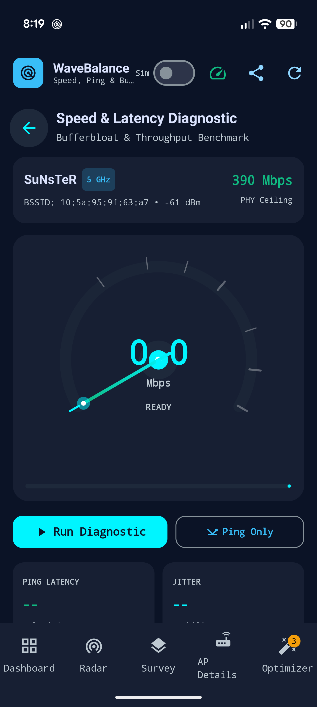
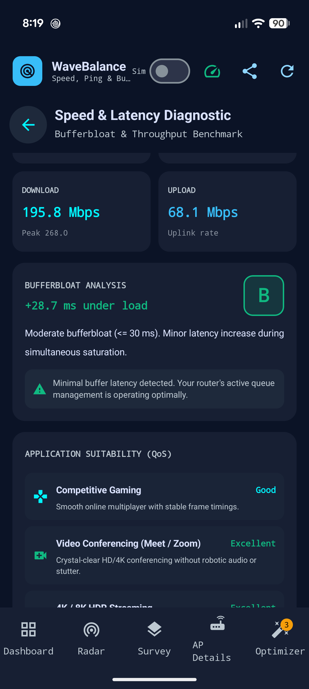
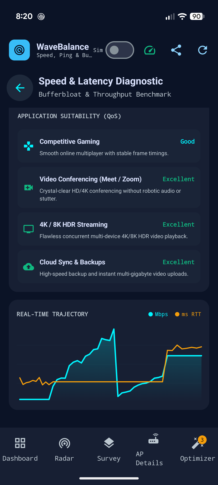
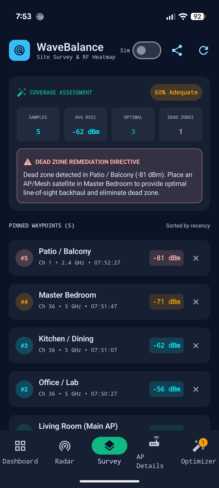
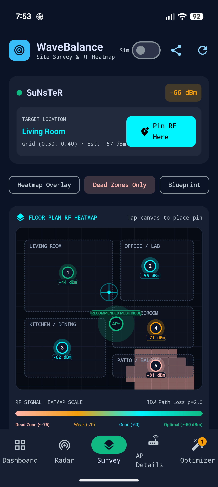
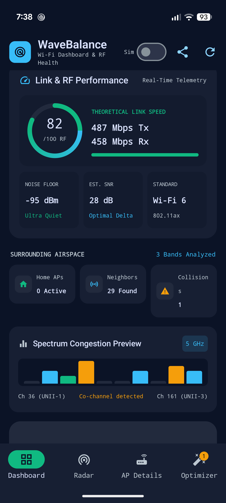

# WaveBalance 📡

[](https://developer.android.com/about/dashboards)
[](https://kotlinlang.org)
[](https://developer.android.com/jetpack/compose)
[](https://m3.material.io)
[](https://stitch.withgoogle.com)
[]()
[]()

> **WaveBalance** is an enterprise-grade, high-precision Wi-Fi spectrum analyzer, channel balancer, roaming monitor, site survey heat mapper, and network diagnostic engine for Android. Built with Jetpack Compose, Material Design 3, and Google Stitch design tokens, WaveBalance quantifies wireless airspace congestion, detects co-channel and adjacent-channel collisions, models parabolic RF envelopes, interpolates spatial signal heatmaps, and calculates mathematically optimal router reconfiguration directives.

---

## 📸 Visual Walkthrough

| 1. Adaptive Dashboard | 2. Multi-Band Spectrum Radar |
|:---:|:---:|
|  |  |
| *Active network telemetry, circular RF health gauge, quick spectrum waterfall, and nearby AP scan feed.* | *Parabolic RF power envelopes across 2.4 GHz, 5 GHz, and 6 GHz spectrum blocks with channel markers.* |

| 3. AP Details & Collision Alerts | 4. Channel Optimizer & Directives |
|:---:|:---:|
|  |  |
| *60-second cubic Bezier RSSI sparkline, jitter ($\sigma$) calculation, hardware OUI vendor decoding, and collision alerts.* | *Before/After spectrum balancing comparison, step-by-step router reconfiguration directives, and congestion matrix.* |

| 5. Analog Speedometer Tachometer | 6. Bufferbloat & QoS Evaluation |
|:---:|:---:|
|  |  |
| *240° logarithmic analog tachometer with cyan sweep trail, glowing needle tip, and real-time digital readout.* | *Active queue management bufferbloat grading (A+ to F), latency under load delta, and 4-tier QoS matrix.* |

| 7. Speed & Latency Trajectory | 8. Site Survey Spatial Heatmap |
|:---:|:---:|
|  |  |
| *Continuous dual-curve time series tracking multi-stream download throughput (Mbps) and ping latency (ms).* | *Inverse Distance Weighting (IDW) signal gradient, interactive pin survey grid, and coverage area stats.* |

| 9. Dead Zone Deficit Analysis | 10. Fast BSS Roaming Monitor |
|:---:|:---:|
|  |  |
| *Automated dead zone detection ($<-75\text{ dBm}$), coverage deficit warnings, and AP placement recommendations.* | *802.11k/v/r Fast Roaming detection, handover trajectory logging, and AP candidate ranking.* |

---

## 🚀 Complete 10-Phase Capabilities

WaveBalance was architected and executed across 10 progressive phases:

### Phase 1: Foundation, Stitch Tokens & Dynamic Telemetry
- **Google Stitch Color System**: Implements dark obsidian (`#0A0F1D`), navy dark surface (`#111827`), card slate (`#1E293B`), neon cyan (`#00F5FF`), and emerald green (`#10B981`).
- **Real-Time Telemetry Hero**: Inspects active Wi-Fi connection parameters including SSID, BSSID, RSSI, Frequency, Channel, Link Speed, IP, and Wi-Fi standard.
- **Circular RF Health Gauge**: Dual-arc sweep gauge computing normalized connection health score derived from SNR, link stability, and channel contention.

### Phase 2: Parabolic RF Spectrum Radar Canvas & Channel Markers
- **Continuous Parabolic RF Curves**: Custom Jetpack Compose Canvas computing quadratic attenuation power envelopes:
  $$y(x) = y_{\text{peak}} - \alpha (x - x_c)^2$$
- **Triple-Band Support**: Seamlessly visualizes **2.4 GHz** (Channels 1–14), **5 GHz** (UNII-1, UNII-2/2e DFS, UNII-3), and **6 GHz** (Wi-Fi 6E/7 PSC channels).
- **Interactive Channel Highlighting**: Tap any channel marker or AP curve to inspect frequency boundaries and conflicting signals.

### Phase 3: Access Point Telemetry, 60s Sparkline & Collision Analysis
- **60-Second Rolling RSSI Sparkline**: High-frequency time-series canvas rendered via cubic Bezier curves (`cubicTo`) with an illuminated beacon at the latest telemetry coordinate.
- **Mathematical Jitter Analysis**: Real-time sample standard deviation calculation:
  $$\sigma = \sqrt{\frac{1}{N-1}\sum_{i=1}^N (x_i - \bar{x})^2}$$
- **-65 dBm Target Threshold**: Calibrated dashed benchmark indicating golden standard for VoIP and competitive gaming.
- **Hardware OUI Vendor Lookup**: Resolves physical manufacturers (Google, Apple, Netgear, Ubiquiti, Cisco, TP-Link, etc.) and detects randomized MAC addresses.
- **Collision & Interference Engine**: Distinguishes between **Co-Channel Interference (CCI)** and **Adjacent-Channel Interference (ACI)**.

### Phase 4: Mathematical Optimizer Engine & Balancing Directives
- **Interference Penalty Algorithm**: Evaluates candidate channels using weighted co-channel collisions ($W_{\text{cci}} = 1.0$), adjacent channel bleed ($W_{\text{aci}} = 0.5$), and DFS penalties.
- **Interactive Before vs. After View**: Visualizes congested spectrum vs. calculated optimal channel allocation in vibrant emerald.
- **Router Configuration Directives**: Synthesizes 5 tailored router admin actions with a one-tap **Copy Setup** button formatted for the Android system clipboard.
- **In-App Channel Migration Simulator**: Test-drive optimized network placements without touching router settings.

### Phase 5: Channel Width & Coexistence Analyzer
- **Multi-Width Envelopes**: Visualizes 20 MHz, 40 MHz, 80 MHz, 160 MHz, and ultra-wide 320 MHz channel allocations.
- **Coexistence & Overlap Detection**: Detects channel bonding collisions and legacy 802.11b/g coexistence penalties.
- **DFS Radar & PSC Markers**: Highlights Dynamic Frequency Selection (DFS) radar-sensitive channels and 6 GHz Preferred Scanning Channels (PSC).

### Phase 6: Fast BSS Roaming Transition & Handover Telemetry
- **802.11 Standards Detection**: Identifies access points advertising 802.11k (Radio Resource Measurement), 802.11v (BSS Transition Management), and 802.11r (Fast BSS Transition).
- **Roaming Threshold Evaluator**: Warns when RSSI drops below roaming trigger thresholds ($-70\text{ dBm}$ to $-75\text{ dBm}$) and ranks candidate APs for seamless handover.

### Phase 7: Real-Time Audio Sonification & Acoustic Beacons
- **Acoustic Geigercounter & Pitch Mapping**: Synthesizes real-time audio frequencies mapping signal strength (higher pitch = stronger signal) and interference density (faster clicks = severe collisions).
- **Audio Diagnostic Mode**: Provides hands-free acoustic feedback during physical antenna alignment and walkthroughs.
- **Hardware Toggle**: Mapped to hardware keyboard shortcut `A` and TopAppBar speaker icon.

### Phase 8: Roaming Event Logger, Session Trajectory & Handover Analytics
- **Live Roaming Trajectory**: Logs BSSID handovers, delta RSSI, transition latency, and channel hops in chronological sequence.
- **Roaming Health Score**: Quantifies handover smoothness and detects roaming ping-pong loops between adjacent APs.
- **Markdown Audit Exporter**: One-tap dispatch of roaming trajectory logs to the native Android system share sheet.

### Phase 9: Site Survey Heat Mapper & Floor Plan Walk Engine
- **Spatial Grid Canvas**: Interactive 2D floor plan walk grid supporting manual pin drops and autonomous auto-walk simulations.
- **Inverse Distance Weighting (IDW) Interpolation**:
  $$z(u) = \frac{\sum_{i=1}^N d_i^{-p} z_i}{\sum_{i=1}^N d_i^{-p}}$$
  Smoothly interpolates signal strength gradients from deep navy (dead zone) to vibrant emerald (excellent).
- **Dead Zone & Deficit Detection**: Identifies coverage holes ($<-75\text{ dBm}$) and calculates percentage deficit metrics with tailored AP placement advice.

### Phase 10: Real-Time Speed, Latency Jitter & Bufferbloat Diagnostic Engine
- **Analog Speedometer Tachometer**: 240° logarithmic circular sweep canvas with Neon Cyan trail, radial ticks, glowing needle tip, and central digital readout.
- **M-Lab NDT7 Speed Engine**: Measures download and upload over one connection each against the nearest [Measurement Lab](https://www.measurementlab.net/) server, with idle ping and latency under load. M-Lab publishes each full test as open data, so the app asks for consent before the first one.
- **Bufferbloat & SQM Analyzer**: Calculates $\Delta_{\text{bufferbloat}} = \text{RTT}_{\text{loaded}} - \text{RTT}_{\text{unloaded}}$ and assigns grades from A+ ($\le 5\text{ ms}$) through F ($> 200\text{ ms}$).
- **Application QoS Suitability Matrix**: Live compatibility ratings for Competitive Gaming, 4K VoIP, 4K/8K Streaming, and Web Browsing.
- **Dual-Curve Trajectory Graph**: Continuous time series displaying throughput (Cyan) and latency (Amber) simultaneously.
- **Markdown Audit Exporter**: Generates diagnostic audit summaries shareable via native Android share sheet.

---

## ⌨️ Hardware Keyboard Shortcuts

WaveBalance supports full desktop and tablet keyboard navigation:

| Key | Action | Function |
|:---:|:---|:---|
| **`S`** | Spectrum Scan | Triggers instant Wi-Fi re-scan or site survey auto-walk step |
| **`M`** | Mock Mode | Toggles between live hardware Wi-Fi and multi-AP simulation |
| **`A`** | Audio Sonification | Toggles real-time acoustic signal & interference sonification |
| **`T`** | Speed Diagnostic | Opens the real-time speed, jitter & bufferbloat engine |
| **`H`** | Site Survey | Opens the spatial floor plan heat mapper |
| **`R`** | Roaming Monitor | Opens the Fast BSS roaming & handover monitor |
| **`O`** | Channel Optimizer | Opens the channel balancer & router configuration directives |

---

## 🎨 Design System & Google Stitch Tokens

WaveBalance is styled using tokens from **Google Stitch** (Project ID: `5449578052354054440`), optimized for dark-mode RF telemetry:

| Token Name | Hex Code | Visual Role |
|:---|:---:|:---|
| `PrimaryObsidian` | `#0A0F1D` | Global app scaffold background |
| `SurfaceNavyDark` | `#111827` | Top app bars, bottom navigation bar, card headers |
| `CardSurfaceSlate` | `#1E293B` | Telemetry cards, canvas backgrounds, dialogs |
| `NeonCyan` | `#00F5FF` | Active network highlights, RF radar parabolas, primary actions |
| `SecondaryContainerEmerald` | `#10B981` | Optimal channel badges, pristine spectrum indicators |
| `WarningAmber` | `#F59E0B` | Moderate contention warnings, DFS radar alerts |
| `ErrorRed` | `#EF4444` | Severe collision alerts, congested channel penalties |

---

## 📱 Hardware & Compatibility

- **Primary Target Device**: Verified on **Google Pixel 10 Pro XL** over wireless ADB TLS.
- **Companion Emulator**: Verified on **ARCVM Android 16** emulator (`emulator-5554`).
- **Android Versions**: API Level 26 (Android 8.0 Oreo) up to API Level 35+ (Android 15 / 16).
- **Wi-Fi Standards Supported**: 802.11b/g/n (Wi-Fi 4), 802.11ac (Wi-Fi 5), 802.11ax (Wi-Fi 6 / 6E), and 802.11be (Wi-Fi 7).
- **Simulation Mode**: Built-in mock telemetry engine accessible directly from the top bar for testing complex multi-AP collision environments on emulators or offline environments.

---

## 🧪 Automated Unit Test Suite

The test suite contains **32 comprehensive unit tests** across 7 test suites, passing 100% green:

| Test Suite | Tests | Scope |
|:---|:---:|:---|
| [`SpeedDiagnosticEngineTest.kt`](app/src/test/java/com/wavebalance/app/SpeedDiagnosticEngineTest.kt) | 7 | Jitter standard deviation, bufferbloat grading, QoS application matrix, Markdown export |
| [`SiteSurveyEngineTest.kt`](app/src/test/java/com/wavebalance/app/SiteSurveyEngineTest.kt) | 7 | IDW interpolation, dead zone detection, survey pin management, stats computation |
| [`ChannelOptimizerEngineTest.kt`](app/src/test/java/com/wavebalance/app/ChannelOptimizerEngineTest.kt) | 4 | Co-channel scoring penalties, channel recommendation, router directives generation |
| [`ApMetricsCalculatorTest.kt`](app/src/test/java/com/wavebalance/app/ApMetricsCalculatorTest.kt) | 5 | Parabolic envelope boundaries, PHY throughput calculation across Wi-Fi 6/7, collision severity |
| [`RoamingMonitorEngineTest.kt`](app/src/test/java/com/wavebalance/app/RoamingMonitorEngineTest.kt) | 4 | 802.11k/v/r capability detection, handover delta evaluation, candidate ranking |
| [`WifiVendorLookupTest.kt`](app/src/test/java/com/wavebalance/app/WifiVendorLookupTest.kt) | 3 | IEEE OUI prefix resolution and locally-administered randomized MAC detection |
| [`RfAuditReportGeneratorTest.kt`](app/src/test/java/com/wavebalance/app/RfAuditReportGeneratorTest.kt) | 2 | Markdown RF audit synthesis and clipboard formatting |
| **Total** | **32** | **100% Passing (0 failures, 0 skipped)** |

Run tests with:
```bash
./gradlew testDebugUnitTest
```

---

## 🛠️ Build & Installation

### Prerequisites
- **JDK 17** (or higher)
- **Android SDK Platform 35**
- **Gradle 8.7+** (Gradle Wrapper included)
- **ADB** (Android Debug Bridge)

### Build from Source
```bash
# Clone the repository
git clone https://github.com/yogeshware/wavebalance.git
cd wavebalance

# Run the unit test suite
./gradlew test

# Compile the debug APK
./gradlew assembleDebug
```

### Deploy to Connected Device
```bash
# Install on Google Pixel 10 Pro XL or connected emulator
adb install -r app/build/outputs/apk/debug/app-debug.apk

# Launch WaveBalance
adb shell am start -n com.wavebalance.app/.MainActivity
```

---

## 📄 License

```text
MIT License

Copyright (c) 2026 Yogeshwar Kaushal

Permission is hereby granted, free of charge, to any person obtaining a copy
of this software and associated documentation files (the "Software"), to deal
in the Software without restriction, including without limitation the rights
to use, copy, modify, merge, publish, distribute, sublicense, and/or sell
copies of the Software, and to permit persons to whom the Software is
furnished to do so, subject to the following conditions:

The above copyright notice and this permission notice shall be included in all
copies or substantial portions of the Software.

THE SOFTWARE IS PROVIDED "AS IS", WITHOUT WARRANTY OF ANY KIND, EXPRESS OR
IMPLIED, INCLUDING BUT NOT LIMITED TO THE WARRANTIES OF MERCHANTABILITY,
FITNESS FOR A PARTICULAR PURPOSE AND NONINFRINGEMENT. IN NO EVENT SHALL THE
AUTHORS OR COPYRIGHT HOLDERS BE LIABLE FOR ANY CLAIM, DAMAGES OR OTHER
LIABILITY, WHETHER IN AN ACTION OF CONTRACT, TORT OR OTHERWISE, ARISING FROM,
OUT OF OR IN CONNECTION WITH THE SOFTWARE OR THE USE OR OTHER DEALINGS IN THE
SOFTWARE.
```
